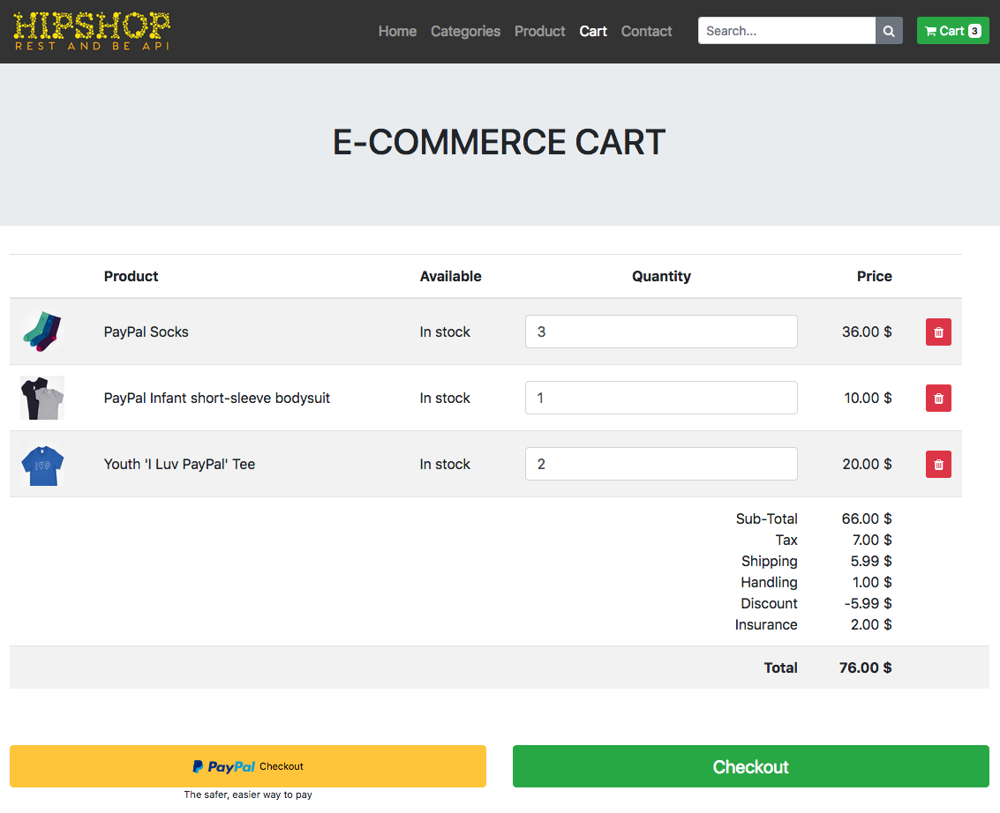
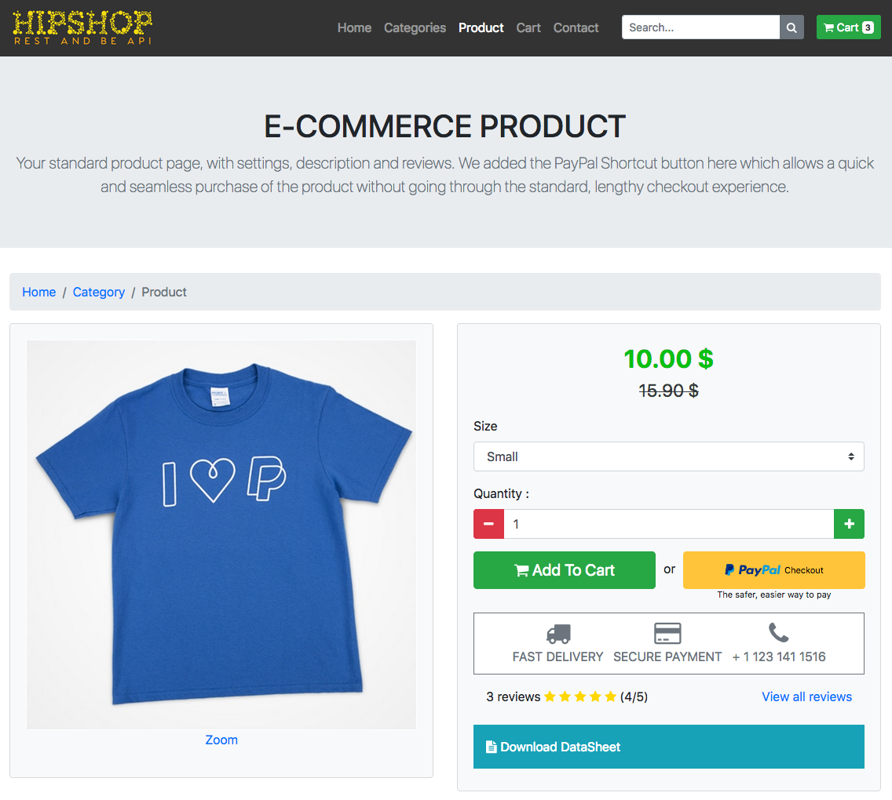
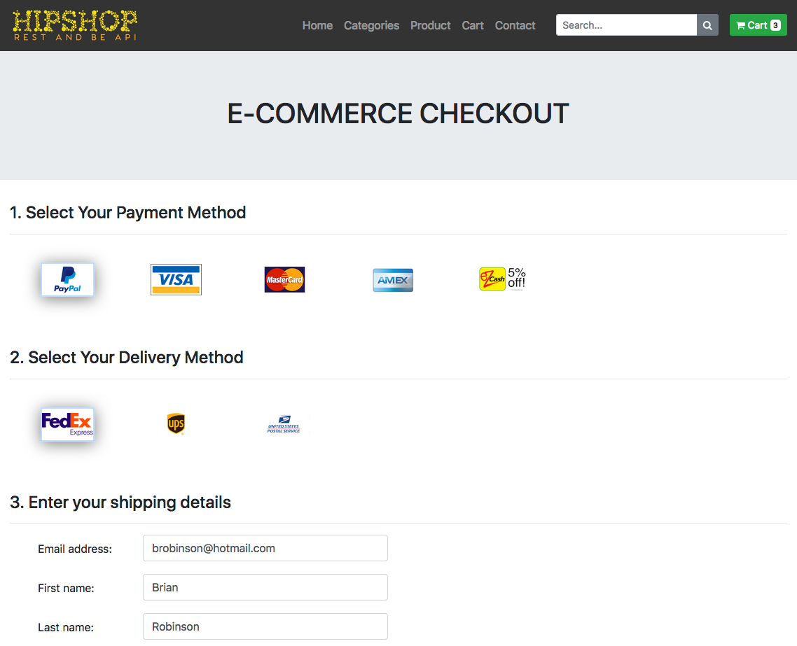

# PayPal REST API integration sample
PayPal integrated through REST API with a simple e-commerce frontend in Bootstrap

PayPal buttons are placed on the cart, product and checkout pages. Each offer a slightly different checkout experience.

## Version 1.0.0
- First version

## Video
[](https://www.youtube.com/watch?v=mW46rvQ5Pts "REST and be API")

## Preview




## Notes
1. The direct API calls are made using cURL. We've set the CURLOPT_SSL_VERIFYPEER variable to false ( ```curl_setopt($ch, CURLOPT_SSL_VERIFYPEER, false);```) to make the API calls work in a non-https localhost-based environments but you should remove this option if you intend to put this sample code online, especially for production use, as this is making the connection insecure.
2. Pay Now and Continue buttons on the PayPal review page can be controlled with the user_action parameter in the payload. Please use user_action=commit to display Pay Now and user_action=continue to display Continue button. 

## Installation
1. Download the package
2. Unzip the package
3. Set your PayPal credentials (clientID and secret) in the settings.php file
4. Transfer on your server (localhost or online)
5. Try it out and share your feedback!

## Thanks
Special thanks to T-PHP for their PHP Ecommerce frontend. You can find it here: http://demo.t-php.fr/bootstrap-4-ecommerce/v1/ 